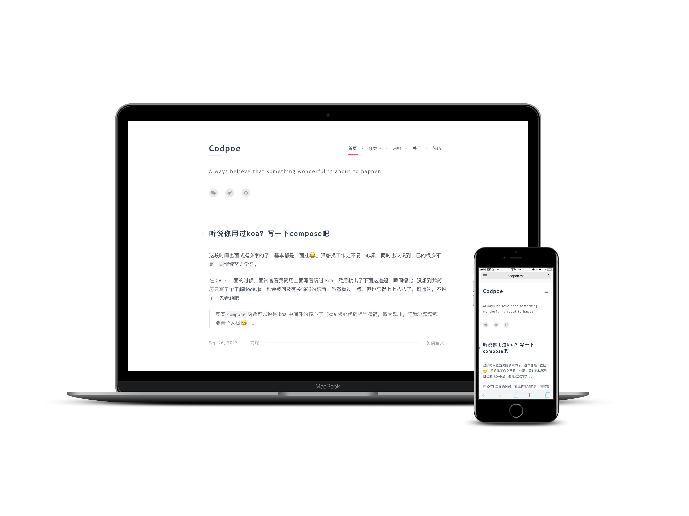

# Poem
[Demo](http://codpoe.me/) | 中文文档（暂无）

An elegant theme for [Hexo](https://hexo.io/). Some of the desgin are inspired by [EVAN YOU's blog](http://evanyou.me).



## Installation
Clone this repository

```
$ git clone git@github.com:Codpoe/hexo-theme-poem.git
```

Then you can modify theme setting in `hexo-theme-poem/_config.yml`.

## Configuration
The default configuration:

```yaml
# If you have any problem about this theme, 
# please let me kown it via email or GitHub issue.
# Thanks!

# primary config
name: Poem ## Your name shown on the header and the drawer
description: Always believe that something wonderful is about to happen ## Introduce yourself
keywords: Blog, Tech
site_name: Poem's blog ## Your site name shown on the first screen
site_description: Life is a Poem ## Introduce your site
logo: https://i.loli.net/2017/08/31/59a79b0b3ffd8.gif ## The logo on the header and the drawer

# first_screen
## 1.
## On the first screen, you can choose to show the image or the color-gradient.
## 2.
## The links part of first screen: you can add any link, 
## just like <GitHub: [your github url]>.
## note: the key of the link will be the word shown on the screen.
first_screen:
  open: true
  img: https://ws3.sinaimg.cn/large/006tNc79gy1fiyf9ncv1tj31kw11odmz.jpg
  gradient:
    left: '#3a6186'
    right: '#89253e'
  dark: true ## If the style of your image or color is dark, set it to true, else false.
  links:
    Gmail: codpoe.me@gmail.com
    Weibo: https://weibo.com
    GitHub: https://github.com

# header
header:
  menu: ## the menu on the header and the drawer, you can customize it.
    home: /
    category: /categories
    archive: /archives
    about: /about
  links: ## the links on the header and the drawer, you can customize it.
    wechat:
      name: Wechat
      img: https://ws3.sinaimg.cn/large/006tKfTcgy1fj8st9kjdwj308w08wq3v.jpg ## your wechat qrcode
    weibo:
      name: Weibo
      url: https://weibo.com
    github:
      name: GitHub
      url: https://github.com

# copyright
copyright: 
  time: 2017 ## The time of copyright in the footer

# disqus
## You can find more infomation on https://disqus.com/.
disqus:
  open: false ## Toggle whether your site open the disqus
  shortname: ## Your disqus shortname
```

## Features
### First Screen
On the first screen, you can choose to show the image or the color-gradient.

Note: If the image or the color you set is dark, remember set the `dark` in `hexo-theme-poem/_config.yaml` to true, or you may not recognize your words (header words, first screen words...) from the background.

### Read More
At most time, we don't want to show the full content of the post, then You can seperate your post content with `<!--more-->`. The content behind the `<!--more-->` will be hidden on the home page.

### Normal Page
If you want to add a normal page with header and footer(eg. the about page), just create a folder that contains a `index.md` file in the `source` folder in the root directory, and add `layout: normal` in `front-matter` in `index.md`.

Note that the normal page will open the comments by default. If you want to close the comments, just normal, add `comments: false` in `front-matter` in `index.md`.

### Clean Page
If you want to add a clean page with nothing that you can customize completely, just create a folder that contains a `index.html` file in the `source` folder in the root directory.

### Languages
Currently only English(default) and Simplified Chinese(zh-CN) are supported.

## More
### How to navigate to the new page?
The url of the new page(normal page or clean page) is `http(s)://[your site address]/[the name of the folder that contains the new page]`.

## Todo
- Some widgets
- The progress bar of the post page
- ...

